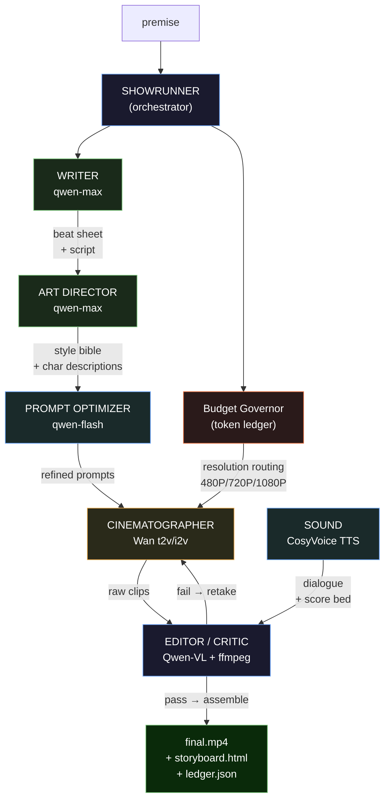

# Auteur — The Budget-Aware AI Showrunner

> An autonomous agent that turns a one-line premise into a finished vertical short drama —
> and directs like a real showrunner: it nails the shot without wasting film.
>
> **Track 2: AI Showrunner** · Global AI Hackathon Series with Qwen Cloud

---

## The thesis

Most short-drama agents are a straight line: `premise → script → generate every shot → stitch`.
They burn tokens blindly and hope the output is good. Track 2 explicitly asks builders to
**"maximize output quality under a limited token budget"** — and almost nobody engineers for it.

**Auteur** treats a production like a real director does: a fixed budget, hard creative
priorities, and a review of the dailies before anything ships. Two systems make it different:

### 1. The Budget Governor — a real token economy
- **Tiered model routing.** Cheap Qwen (Flash/Turbo) handles grunt work — shot-list formatting,
  prompt cleanup. `qwen-max` is reserved for the creative-critical beats: the hook, the dialogue,
  the final cut decisions.
- **Asset caching.** The Character & Style Bible is generated once and reused across every shot,
  instead of re-describing characters per prompt.
- **Importance-weighted retakes.** Reshoot budget is spent on the highest-impact shots first
  (the opening hook earns more retakes than a B-roll cutaway).
- **Early-exit.** When the critic's quality score clears threshold, the shot passes — no wasted
  reshoots.
- Every production emits a **token ledger** (`ledger.json`): who spent what, on which beat, and why.

### 2. The Qwen-VL critic loop — multimodal orchestration, not fire-and-forget
After each clip renders, **Qwen-VL watches it** and scores it against the storyboard on four axes —
prompt adherence, character consistency, shot quality, and **cross-shot visual continuity** (comparing
frames against the previous shot to catch character drift). A failing take gets exactly one budgeted
reshoot with a corrected prompt; a passing take moves to the cut. This is the vision model closing
the loop on the video model, which is what "multimodal orchestration" actually means.

### The proof: a real production, live on Alibaba Cloud

These are **measured live** — Qwen-Max wrote the script, Wan rendered the footage, and
**Qwen-VL scored the real frames** (not mocks) on DashScope International:

> **Premise:** *"A lighthouse keeper teaches the drone sent to replace him"*
>
> | Metric | Live result |
> |---|---|
> | **Avg Qwen-VL critic score** | **7.3 / 10** (shots scored 8.0, 8.0, 6.0 on real Wan footage) |
> | **Token budget used** | **13,043 / 120,000 — just 10.9%** |
> | **Model-routing savings** | **46%** (13,043 actual vs 23,999 if every call used `qwen-max`) |
> | **Real spend** | **$0.60** for the rendered clips |
> | Tier split | grunt `qwen-flash` 5,478 · creative `qwen-max` 4,298 · vision `qwen-vl-max` 3,267 |
>
> The Budget Governor delivered a 7.3/10 production using a tenth of the budget, while the
> tiered router cut token spend nearly in half versus a naive all-`qwen-max` pipeline.

**Evaluation harness.** Auteur ships an A/B benchmark (`bench/`) that runs the same premises
through a **naive baseline** and through **Auteur**, with **Qwen-VL as an impartial judge**
scoring both. It runs deterministically in mock mode (to validate the harness with no spend) and
against live models with a key. In a field where ~95% of submissions are demos with zero
evaluation, a real benchmark is the cheapest signal of production-grade engineering.

**Ablation study.** Auteur also ships a feature-contribution analysis (`bench/ablation.py`):
each architectural feature is disabled in turn (critic loop, prompt optimizer, style bible,
tiered routing) and the quality impact is measured. This proves every design decision earns its
place — it's not a grab bag of features, it's an engineered system.

---

## Architecture



| Stage | Model(s) | Role |
|-------|----------|------|
| Showrunner | `qwen-max` (plan) · `qwen-flash` (routing) | Budget + orchestration |
| Writer | `qwen-max` | Premise → logline → beat sheet → scripted shots (structured JSON) |
| Art Director | `qwen-max` + `qwen-vl-max` | Character & Style Bible for cross-shot consistency |
| Prompt Optimizer | `qwen-flash` | Refine video prompts for Wan's strengths (pays for itself in fewer retakes) |
| Cinematographer | `wan2.2-t2v-plus`, Wan i2v | Render shots; image-to-video for continuity; dynamic resolution |
| Sound | CosyVoice v3-plus TTS | Dialogue voicing (English voices) + procedural score bed |
| Editor / Critic | `qwen-vl-max` + ffmpeg | 4-axis scoring (incl. cross-shot continuity); assemble final cut |

All model calls go through Alibaba Cloud **DashScope** (international endpoint,
OpenAI-compatible). See [`deploy/`](deploy/) for the Alibaba Cloud deployment (ECS backend +
OSS asset storage) and the proof-of-deployment file.

### Production deliverables (per run)

Every Auteur production outputs five first-class artifacts:

| Artifact | What it is |
|----------|-----------|
| `final.mp4` | The assembled vertical short with dialogue, score, and crossfade transitions |
| `storyboard.html` | Self-contained visual breakdown: every shot's frames, critic scores, budget analytics, Governor decisions |
| `manifest.json` | Full production state: script, shots, scores, timeline, report card, quality arc |
| `ledger.json` | Per-call token ledger: who spent what, on which beat, using which model tier |
| `score.wav` | AI-directed procedural music bed (mood-keyed triad pad) |

---

## How this maps to the judging criteria

| Criterion | How Auteur scores |
|-----------|-------------------|
| **Narrative ability** | Structured beat-sheet screenwriting with importance-weighted beats, not one-shot prompting |
| **Multimodal orchestration** | Qwen-Max + Qwen-VL + Wan + CosyVoice TTS coordinated in a 4-axis critic loop with cross-shot continuity scoring |
| **Output quality under a token budget** | The Budget Governor — a live 7.3/10 production using 10.9% of budget with 46% routing savings, plus a naive-vs-Auteur benchmark and an ablation study proving each feature's contribution |
| **Production-readiness** | Alibaba Cloud (ECS + OSS + DashScope), token ledger, eval harness, ablation study, 73 tests, storyboard export, live web viewer |
| **Innovation** | Adaptive scarcity-aware retakes, cross-shot visual continuity, dynamic resolution routing, prompt optimizer, tone-aware transitions, storyboard export — not a linear pipeline |

---

## Run it now — no API key required

Auteur ships a **mock mode**: the full pipeline runs offline with deterministic fakes and a
bundled static ffmpeg, producing a *real assembled `.mp4`*, a real token ledger, and a real
benchmark report. This is how you verify the architecture end-to-end without spend.

```bash
pip install -r requirements.txt
AUTEUR_MOCK=1 python -m auteur.cli "A lighthouse keeper teaches the drone sent to replace him"
# -> out/final.mp4  +  out/ledger.json (tokens by stage, clips, retakes)
```

Run the benchmark harness (naive baseline vs. Auteur, with the Qwen-VL judge):

```bash
AUTEUR_MOCK=1 python -m bench.benchmark --premises bench/premises.txt
```

Run the ablation study (proves each architectural feature pulls its weight):

```bash
AUTEUR_MOCK=1 python -m bench.ablation --premise "A lighthouse keeper teaches the drone sent to replace him"
```

Run the test suite:

```bash
AUTEUR_MOCK=1 python -m pytest -q
```

## Go live

```bash
cp .env.example .env          # add your DashScope (Alibaba Cloud Model Studio) key

# See what a production would cost before spending a cent:
python -m auteur.cli "A night-shift nurse finds a note from a patient" --estimate

# Render for real, with a hard $1 spend cap as a safety net:
python -m auteur.cli "A night-shift nurse finds a note from a patient" --max-spend-usd 1.00

# Only keep shots scoring >= 6.0 in the final cut (quality over quantity):
python -m auteur.cli "A night-shift nurse finds a note from a patient" --quality-gate 6.0

# Hero shots at 1080P, grunt shots at 480P (dynamic budget-optimized resolution):
python -m auteur.cli "A night-shift nurse finds a note from a patient" --dynamic-resolution
```

With a key present, the same code paths call Qwen-Max / Qwen-VL (OpenAI-compatible endpoint)
and Wan for real renders — mock vs. live is a single config flip (`AUTEUR_MOCK`).

**Real-money guardrail.** Video generation is the only line item that costs real money, so the
Budget Governor enforces a hard USD ceiling (`--max-spend-usd`, default $2.00): it stops
rendering *before* a clip would push estimated spend past the cap, and `--estimate` prints the
projected best/worst-case cost without rendering anything. Default model is `wan2.2-t2v-plus`
(available on the DashScope International free tier); point `AUTEUR_MODEL_WAN_T2V` at
`wan2.7-t2v` once paid billing is enabled.

`scripts/probe_wan.py` is a standalone diagnostic that probes the video endpoint directly and
reports which Wan model names your account can call — useful for a fast 403/quota check.

**Pre-flight diagnostic.** Before going live, validate the full pipeline:

```bash
python scripts/diagnose.py    # checks ffmpeg, API key, models, runs a test production
```

## Deploy

One-command deployment with Docker Compose:

```bash
cp .env.example .env          # add your DashScope key
docker compose up -d           # API on :8000, viewer on :8080
```

**Backend API** (`:8000`):
- `POST /produce` — render a short from a premise (JSON body)
- `GET /healthz` — liveness + live DashScope/OSS check
- `GET /gallery` · `GET /metrics` — browse past productions + aggregate stats
- `GET /productions/{id}/final.mp4` · `/storyboard.html` · artifacts
- `GET /docs` — interactive Swagger/OpenAPI docs (auto-generated)
- CORS enabled for browser clients

**Frontend** (`:8080`):
- **Studio** (`/`) — submit a premise and watch the production stream live via SSE: script,
  Style Bible, per-shot 4-axis critic verdicts, and budget bars, all in real time.
- **Gallery** (`/gallery`) — a showcase grid of every production with hover-play video previews,
  critic scores, token counts, and links to each storyboard, plus headline aggregate metrics.

## Status

**Live-validated pipeline.** Full end-to-end productions run on Alibaba Cloud DashScope with
real Wan video generation, Qwen-Max/VL orchestration, and AI-directed scoring. A live run of
*"A lighthouse keeper teaches the drone sent to replace him"* produced real vertical Wan footage
scored **7.3/10** by Qwen-VL, using **10.9%** of the token budget and **$0.60** of render spend,
with the tiered router cutting token cost **46%** versus a naive all-`qwen-max` pipeline.

Working today:
- Budget Governor + token ledger (13K tokens / 10.9% of budget for a live multi-shot film)
- 4-axis Qwen-VL critic loop: prompt adherence, character consistency, shot quality, cross-shot visual continuity
- Importance-weighted retakes with adaptive scarcity: bar rises as budget depletes
- Visual continuity: i2v frame-chaining via OSS-uploaded anchor frames (with t2v fallback)
- Cross-shot continuity scoring: critic compares frames from adjacent shots to catch character drift
- Smart dialogue voice attribution: parses speaker tags, character name mentions, with parity fallback
- CosyVoice v3-plus dialogue voicing with English-compatible character voices (17 voice descriptors)
- AI-directed procedural score (mood-keyed triad pad mixed under dialogue)
- Intelligent scene transitions: tone-aware cut/dissolve/fade selection per beat boundary
- Crossfade assembly with Windows-safe concat-filter fallback
- Resilient production: voice failures never discard clips, partial-shot recovery
- Production report card in the manifest (quality arc, budget utilization, cost summary)
- Parallel shot rendering when `--no-consistency` is set (wall-clock speedup with thread pool)
- Tier-level token breakdown: proves model routing works (grunt/creative/vision spend)
- Prompt optimizer: dedicated Wan-specific prompt refinement agent (grunt-tier, pays for itself)
- Dynamic resolution routing: hero shots at 1080P, grunt shots at 480P (per-shot budget optimization)
- Shot pacing engine: variable clip duration based on beat importance and type
- Storyboard HTML export: visual production breakdown with frames, scores, and budget analytics
- Live web Studio: real-time critic verdicts, retake decisions, and budget status bars (SSE)
- Production Gallery: showcase grid with hover-play previews, scores, and aggregate metrics
- Hardened FastAPI backend: CORS, auto-generated Swagger docs, /gallery + /metrics endpoints
- 81 passing tests, naive baseline, benchmark harness

See [`ARCHITECTURE.md`](ARCHITECTURE.md) for the full design, module map, and roadmap.

## License

MIT — see [`LICENSE`](LICENSE).
