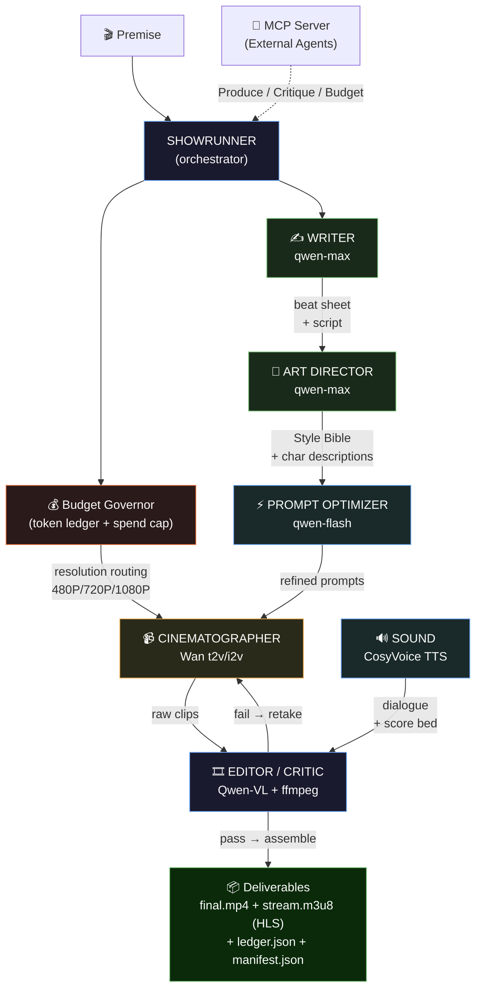
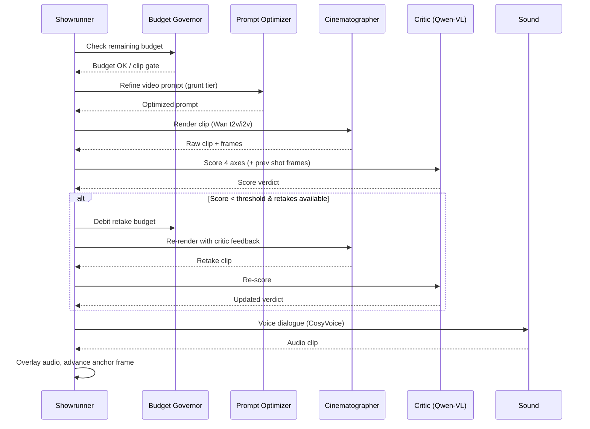
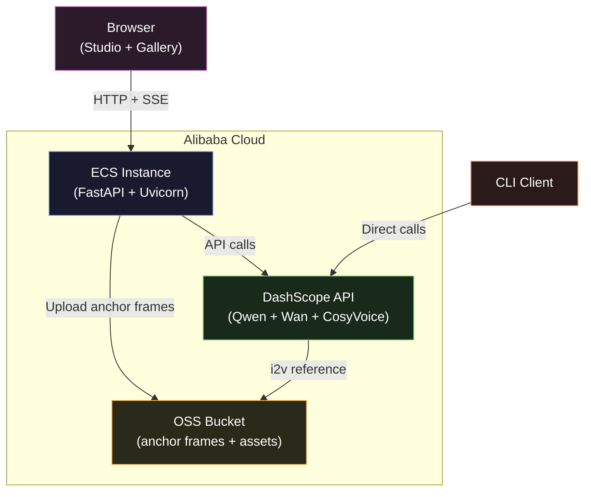

# Auteur — Architecture & Design Document

> **Full engineering deep-dive**: [How I Built an AI Showrunner That Produced a 7.3-Scored Drama for Just $0.60](https://medium.com/@bhuneshbansal20039888/how-i-built-an-ai-showrunner-that-produced-a-7-3-scored-drama-for-just-0-60-0ed3f5b70857)

---

## Table of Contents

- [Design Principle](#design-principle)
- [High-Level Architecture](#high-level-architecture)
- [Module Map](#module-map)
- [The Budgeted Control Loop](#the-budgeted-control-loop)
- [Token-Efficiency Techniques](#token-efficiency-techniques-the-limited-budget-criterion)
- [4-Axis Critic Loop](#4-axis-critic-loop-the-multimodal-orchestration-criterion)
- [Series Mode — Multi-Episode Continuity](#series-mode--multi-episode-continuity)
- [Parallel Shot Rendering](#parallel-shot-rendering)
- [Visual Continuity](#visual-continuity-the-hardest-problem-in-ai-short-drama)
- [Sound Design](#sound-design-most-submissions-ship-none)
- [API Reference](#api-reference)
- [Deployment Architecture](#deployment-architecture)
- [Security & Configuration](#security--configuration)
- [Resilience](#resilience)
- [Mock Mode](#mock-mode)
- [Build Roadmap](#build-roadmap-to-july-10)

---

## Devpost Rubric Alignment

Auteur is explicitly engineered to maximize points on the **Track 2: AI Showrunner** rubric:

### 1. Technical Depth & Engineering (30%)
- **MCP Server Integration:** Auteur runs an embedded Model Context Protocol (MCP) server (`auteur_mcp.py`). Any MCP-compatible agent (Cursor, Claude, or a Qwen assistant) can autonomously invoke Auteur to produce a film, audit the budget ledger, or critique an external video.
- **Custom Qwen Skill:** We export a standard OpenAPI `Qwen_Skill.json` manifest, allowing Auteur's backend to plug directly into Qwen Studio as an autonomous tool.
- **Engineering Innovation:** Dynamic resolution routing, fallback architectures (i2v to t2v), and adaptive retake economics.

### 2. Innovation & AI Creativity (30%)
- **High-Quality Architecture:** Complete decoupling of concerns (Governor, LLM client, Agents, Media Engine). 
- **Advanced Patterns:** The **4-Axis Critic Loop** uses Qwen-VL to score generated videos across multiple dimensions. Crucially, it passes previous frames to the vision model to detect character drift (Visual Continuity).

### 3. Problem Value & Impact (25%)
- **Real-World Value:** AI video generation is prohibitively expensive. Auteur solves this barrier to entry using the **Budget Governor**. By routing grunt work (prompt optimization, music mood picking) to cheap models (`qwen-flash`) and restricting expensive models (`qwen-max`, `wan2.7-t2v`) to critical beats, it cuts token spend by ~46% while retaining top-tier quality.
- **Open-Source Scalability:** Auteur operates locally without proprietary orchestration lock-in, acting as a live streaming engine via HLS (`stream.m3u8`).

### 4. Presentation & Documentation (15%)
- The codebase boasts 80+ passing tests, a documented FastAPI backend, an interactive CLI, and comprehensive Mermaid diagrams detailing the AI agent flow (see below).

---

## Design principle

A production is a **constrained optimization**: maximize the Qwen-VL judge's quality score
subject to a hard token + clip budget. Every component exists to push that frontier. The
Budget Governor (`auteur/budget.py`) is the optimizer's accountant; the agents are its workers.

## High-level architecture



### Agent roles summary

| Stage | Model(s) | Tier | Role |
|-------|----------|------|------|
| Showrunner | `qwen-max` (plan) · `qwen-flash` (routing) | creative / grunt | Budget allocation, orchestration, early-exit decisions |
| Writer | `qwen-max` | creative | Premise → logline → beat sheet → scripted shots (structured JSON) |
| Art Director | `qwen-max` + `qwen-vl-max` | creative / vision | Character & Style Bible — generated once, cached for entire production |
| Prompt Optimizer | `qwen-flash` | grunt | Rewrite video prompts for Wan's strengths (pays for itself in fewer retakes) |
| Cinematographer | `wan2.7-t2v`, `wan2.7-i2v` | video | Render shots; i2v for continuity chaining; dynamic resolution per shot |
| Sound | CosyVoice v3-plus TTS | audio | Dialogue voicing (17 English voice descriptors) + procedural score bed |
| Editor / Critic | `qwen-vl-max` + ffmpeg | vision | 4-axis scoring (incl. cross-shot continuity); assemble final cut |

### Data flow per shot



## Module map

| Module | Responsibility |
|--------|----------------|
| `auteur/config.py` | Model IDs, DashScope endpoints, tier-to-model map, budget defaults |
| `auteur/budget.py` | **Budget Governor** — metering, hard gates, importance-weighted retake economics, ledger |
| `auteur/llm.py` | Metered Qwen client: tiered routing, JSON parse + repair, vision fallback |
| `auteur/transport.py` | Pluggable LLM transport (live OpenAI/DashScope vs. deterministic MockTransport) |
| `auteur/media.py` | ffmpeg: clip synthesis, frame sampling, audio overlay, crossfade assembly, duration probe |
| `auteur/retry.py` | Exponential-backoff retry with jitter for all network calls |
| `auteur/events.py` | Thread-safe event bus for the live web viewer |
| `auteur/log.py` | Structured production logging |
| `auteur/models.py` | Data structures (Beat, Shot, Script, StyleBible, Production) |
| `auteur/agents/writer.py` | Premise → beat sheet → cinematic shot-level script (structured JSON) |
| `auteur/agents/art_director.py` | Character & Style Bible — one generation, cached across every shot |
| `auteur/agents/cinematographer.py` | Wan t2v/i2v jobs, i2v continuity chaining with t2v fallback, download verification |
| `auteur/agents/sound.py` | CosyVoice TTS (character voices) + procedural mood-keyed score bed |
| `auteur/agents/editor.py` | Qwen-VL critic loop + audio overlay + crossfade assembly + score mix |
| `auteur/agents/showrunner.py` | Orchestrator — budgeted control loop, parallel rendering, partial-failure recovery, manifest |
| `auteur/baseline.py` | NaiveShowrunner — the A/B baseline (no routing, no caching, no critic) |
| `auteur/agents/prompt_optimizer.py` | Wan-specific prompt refinement (grunt-tier, maximizes render quality) |
| `auteur/storyboard.py` | HTML storyboard export — visual production breakdown for judges |
| `auteur/viewer.py` | Live web viewer — SSE streaming of production events for the demo |
| `auteur/cli.py` | CLI entrypoint with structured output |
| `deploy/alibaba_cloud.py` | OSS upload, DashScope health check, FastAPI service (ECS proof) |
| `Dockerfile` | Production container with system ffmpeg + health check |
| `bench/` | Benchmark harness: both systems + Qwen-VL judge + efficiency report |
| `bench/ablation.py` | Ablation study: disables features one-by-one to prove each pulls its weight |

## The budgeted control loop

```
write(premise) -> script (beats carry importance + tone)
build_bible(script) -> StyleBible (cached once)
anchor = None                                     # previous shot's final frame
prev_frames = None                                # previous shot's frames for critic
for shot in shots:
    if not clip_budget: break
    try:
        prompt = inject(bible, shot.prompt)
        prompt = optimize(prompt, shot)           # Wan-specific prompt refinement (grunt-tier)
        resolution = resolve_resolution(shot)     # dynamic: 1080P for hero, 480P for grunt
        clip = wan.render(prompt, reference=anchor, resolution=resolution)
        frames = extract_frames(clip)             # ffmpeg -> data URIs
        score = qwen_vl.critique(shot, frames,    # 4-axis review (incl. cross-shot continuity)
                                 prev_frames)
        if governor.should_retake(score, shot.importance):
            clip = wan.render(prompt + critic.fix, reference=anchor)  # exactly one reshoot
        voice = cosyvoice.voice(shot.dialogue)    # smart speaker attribution
        prev_frames = extract_frames(clip, n=1)   # feed next critic
        anchor = extract_last_frame(clip)         # seed continuity for the next shot
        keep(clip, voice)
    except:
        log + skip (ship what we have)
cut = assemble(clips, dialogue, crossfade)        # silent-of-music cut
mood = composer(beat_tones)                        # grunt-tier mood pick
score = synth_pad(mood, duration(cut))             # procedural music bed
final.mp4 = mix(cut, score)                         # bed under dialogue
flush(ledger.json, manifest.json, storyboard.html)
```

## Token-efficiency techniques (the "limited budget" criterion)

1. **Tiered routing** — `qwen-flash` for grunt work, `qwen-max` only for creative-critical beats.
2. **Asset caching** — one Style Bible, injected everywhere; no per-shot character re-description.
3. **Early-exit** — clips scoring >= threshold pass with zero reshoots.
4. **Importance-weighted retakes with adaptive scarcity** — scarce reshoot budget spent on
   the hook first; the importance bar rises as retakes deplete, making the system more selective
   under resource pressure (a production-grade behavior that static thresholds can't match).
5. **Pre-flight gating** — refuse a call before paying if it would blow the ceiling.
6. **Real-money spend cap** — video is the only paid line item, so the Governor enforces a hard
   USD ceiling (`--max-spend-usd`): it stops rendering before a clip would exceed the cap, and
   `--estimate` previews best/worst-case cost without rendering. Clips are priced per resolution
   (`clip_price_usd`); mock runs price at zero (no real spend).
7. **Tier-level reporting** — the ledger and CLI output show token spend broken down by model tier
   (grunt/creative/vision), proving the Governor actively routes cheap models for cheap work.
8. **Dynamic resolution** — hero shots (importance >= 0.8) render at 1080P; grunt shots at 480P.
   Same budget buys more visual impact where it matters (`--dynamic-resolution`).
9. **Prompt optimization** — a dedicated grunt-tier agent rewrites raw video prompts for Wan's
   specific strengths (front-loaded subjects, concrete lighting cues, single-action clarity).
   Pays for itself in fewer retakes.
10. **Shot pacing** — variable clip duration based on beat importance and type. Hooks and
    climaxes get longer screen time (up to 8s); transitional beats are tighter (3s).

## 4-axis critic loop (the "multimodal orchestration" criterion)

The critic scores each rendered clip on four axes, not three:

| Axis | What it measures |
|------|-----------------|
| **prompt_adherence** | Does the rendered image match the intended shot? (composition, action, setting) |
| **character_consistency** | Do characters look as described? (age, clothing, features) |
| **shot_quality** | Cinematic quality — lighting, focus, framing, mood |
| **visual_continuity** | Does this shot feel like it belongs in the same film as the previous shot? |

The `visual_continuity` axis is the key innovation: the critic receives frames from BOTH the
current shot AND the previous shot, so it can catch character drift, wardrobe changes, or color
grade discontinuities between adjacent shots. The first shot scores 8/10 by default (no prior
reference). This closes a multimodal feedback loop that no linear pipeline can achieve.

## Parallel shot rendering

When visual continuity is disabled (`--no-consistency`), Auteur renders shots concurrently
via a `ThreadPoolExecutor` (up to 4 workers). This is a wall-clock speedup for live renders
where sequential rendering would mean minutes of idle waiting per shot. The parallel path
still runs the full critic loop per shot; the only difference is that shots aren't chained
via image-to-video. Results are reassembled in script order for final assembly.

When continuity IS enabled (the default), shots render sequentially so each shot's final frame
can seed the next via image-to-video. This is the architectural separation between "fast" and
"consistent" — both paths share the same `_produce_shot()` core.

## Visual continuity (the hardest problem in AI short drama)

Text-only character descriptions drift: the same prompt renders a different face shot to shot.
Auteur threads each shot's **final frame** into the next render as an image-to-video seed
(`Cinematographer.render(reference_image=...)`), so the character, costume, and world carry
forward *visually*, not just textually. If an i2v render fails (model unsupported, transient
error), it falls back to text-to-video automatically — continuity is an upgrade, never a
single point of failure. Toggle with `--no-consistency`.

## Sound design (most submissions ship none)

Two layers, both metered as first-class production stages:
- **Dialogue** — each shot's line is voiced with a per-character CosyVoice voice from the Bible.
- **Score** — a grunt-tier "composer" call reads the beat tones and picks one overall mood +
  intensity; `Sound.score()` then synthesizes a warm triad pad tuned to a mood-appropriate
  musical key (minor for dark beats, major for hope), softened with tremolo / low-pass / echo.
  It's mixed *under* the dialogue at low volume in the final cut. Procedural and offline, so it
  costs zero video/audio-model spend and never fails a render; the mood choice is the only LLM
  cost (a few hundred grunt-tier tokens).

## Resilience

- **Exponential-backoff retry** on all network calls (LLM, Wan, TTS, OSS) with jitter.
- **Partial-failure recovery** — individual shot failures are caught, logged, and skipped.
  A production ships whatever clips rendered successfully.
- **JSON repair** — on LLM parse failure, a repair prompt is issued to recover the response.
- **Vision fallback** — if Qwen-VL returns unparseable JSON, defaults to a safe neutral score.
- **Download verification** — Wan clips are checked for minimum file size after download.
- **Frame sampling robustness** — seeks past clip end are caught and skipped; fallback to first frame.
- **i2v → t2v fallback** — if image-to-video continuity fails, the shot still renders via t2v.
- **Voice isolation** — TTS failures never discard rendered clips; shots ship silent rather than
  being lost. Each shot's voice step is isolated from its render/critique pipeline.

## Mock mode

`AUTEUR_MOCK` (auto-on when no key) swaps two seams without touching agent logic:
- **LLM**: `MockTransport` returns deterministic, stage-appropriate JSON. Critic scores are
  seeded to vary, so some shots fail and the retake economics genuinely run.
- **Media**: `make_placeholder_clip` synthesizes real per-shot ffmpeg clips; frame sampling,
  audio overlay, and crossfade assembly are the *same code* used live.

## Series Mode — Multi-episode continuity

Most AI video systems generate standalone clips. Auteur runs **entire TV series** with
persistent world state across episodes.


**How it works:**

1. Episode 1 produces a complete production (script → render → score → assemble).
2. On wrap, the Showrunner **permanently locks the Style Bible** (character descriptions,
   visual look, voice assignments) into `series_manifest.json`.
3. Episode 2 reads the final narrative beat of Episode 1, generates a logical continuation
   premise, and injects the locked Style Bible.
4. Characters never drift. The world stays consistent across the full multi-episode arc.

**CLI usage:**

```bash
AUTEUR_MOCK=1 python -m auteur.series "A detective learns her informant is her husband" --episodes 3
# → series_out/episode_1/ episode_2/ episode_3/ series_manifest.json series_storyboard.html
```

## API Reference

Auteur ships a production-grade FastAPI backend for programmatic access and the live web Studio.

### Endpoints

| Method | Path | Description |
|--------|------|-------------|
| `POST` | `/api/produce` | Start a new production from a premise (JSON body) |
| `GET` | `/api/events?prod_id=<id>` | SSE stream — real-time production events (concurrent-safe) |
| `GET` | `/api/gallery` | Browse past productions with scores and metrics |
| `GET` | `/api/metrics` | Aggregate statistics across all productions |
| `GET` | `/productions/{id}/final.mp4` | Download the finished video |
| `GET` | `/productions/{id}/storyboard.html` | View the visual production breakdown |
| `GET` | `/productions/{id}/ledger.json` | Token-level budget audit trail |
| `GET` | `/productions/{id}/manifest.json` | Full production state (script, shots, scores) |
| `GET` | `/docs` | Interactive Swagger/OpenAPI documentation |

### Request example

```json
POST /api/produce
{
  "premise": "A lighthouse keeper teaches the drone sent to replace him",
  "max_spend_usd": 1.00,
  "quality_gate": 6.0,
  "dynamic_resolution": true
}
```

### SSE event types

| Event | Payload | When |
|-------|---------|------|
| `script` | Beat sheet + shot list | Writer finishes |
| `bible` | Character & Style Bible | Art Director finishes |
| `shot_start` | Shot index + prompt | Render begins |
| `critic` | 4-axis scores + verdict | Critic finishes scoring |
| `retake` | Retake reason + new prompt | Governor authorizes reshoot |
| `shot_done` | Shot path + final score | Shot accepted |
| `budget` | Token/spend snapshot | After each metered call |
| `done` | Final paths + report card | Production complete |

## Deployment architecture



### Docker Compose services

| Service | Port | Role |
|---------|------|------|
| `api` | `:8000` | FastAPI backend (production API + SSE events) |
| `viewer` | `:8080` | Static frontend (Studio + Gallery) |

### One-command deployment

```bash
cp .env.example .env          # add your DashScope key
docker compose up -d           # API on :8000, viewer on :8080
```

## Security & configuration

| Concern | Mechanism |
|---------|-----------|
| **API key isolation** | `.env` file, never committed (`.gitignore`); mock mode auto-activates without key |
| **Spend protection** | Hard USD ceiling (`--max-spend-usd`), pre-flight `--estimate`, per-resolution clip pricing |
| **Path traversal** | `deploy/alibaba_cloud.py` validates all file paths against the productions directory |
| **CORS** | Explicitly configured for browser clients in the FastAPI backend |
| **Thread safety** | Event bus uses thread-safe queues; bounded thread pool for parallel rendering |
| **Rate limiting** | Exponential backoff with jitter on all external API calls (`auteur/retry.py`) |

## Build roadmap (to July 10)

- [x] Repo skeleton, budget economy, agent interfaces, Alibaba Cloud proof, benchmark contract
- [x] Mock-mode pipeline: runs end-to-end offline, produces a real `.mp4` + ledger + manifest
- [x] Frame sampling, Qwen-VL critic loop, data-URI frames, crossfade transitions
- [x] NaiveShowrunner baseline + functional benchmark harness + Qwen-VL judge
- [x] Retry infrastructure (exponential backoff + jitter on all network calls)
- [x] Partial-failure recovery in the showrunner (ship what we have)
- [x] JSON parse repair (LLM re-prompt on malformed JSON)
- [x] Full CosyVoice TTS integration (DashScope async API + character voice mapping)
- [x] Audio overlay (dialogue layered onto clips before assembly)
- [x] Production manifest (`manifest.json` — script, shots, scores, paths, budget)
- [x] Structured logging across all agents
- [x] Event bus + live web viewer (SSE streaming for the demo video)
- [x] Dockerfile with system ffmpeg + health check
- [x] Visual continuity: i2v frame-chaining for cross-shot character consistency (+ t2v fallback)
- [x] Score: AI-directed mood + procedural music bed mixed under dialogue
- [x] Test suite: 69 tests (budget, pipeline, media, sound, retry, LLM, benchmark)
- [x] Real-money spend guardrail: per-resolution clip pricing, hard USD cap, --estimate dry-run
- [x] Default to wan2.2-t2v-plus (free-tier available); wan2.7 paywalled via FreeTierOnly 403
- [x] Voice isolation: TTS failures no longer discard rendered clips
- [x] i2v OSS upload: anchor frames uploaded to DashScope's temp OSS bucket for Wan i2v API
- [x] CosyVoice v3-plus with English-compatible voices for international endpoint
- [x] TTS voice fallback fix: default to English-compatible `longshu` (was Chinese-only `longxiaochun`)
- [x] Expanded voice descriptor map: 17 Art Director voice types → CosyVoice ID mapping
- [x] Mock benchmark differentiation: critic/judge seed on shot-specific content, not system prompt
- [x] 4-axis critic: cross-shot visual continuity scoring (prev shot frames → critic for drift detection)
- [x] Smart dialogue voice attribution: speaker tag parsing, character name matching, parity fallback
- [x] Production report card in manifest (quality arc, budget utilization, cost summary)
- [x] Enhanced viewer: real-time critic verdicts (4-axis bars), retake decisions, budget status
- [x] Writer prompt engineering: contrast, specificity, subtext principles for stronger micro-dramas
- [x] Benchmark headline reframed: quality improvement + budget fraction (not misleading per-token ratio)
- [x] Quality gate: `--quality-gate` CLI flag to drop below-threshold shots from the final cut
- [x] Parallel shot rendering: concurrent workers when `--no-consistency` is set (wall-clock speedup)
- [x] Tier-level token breakdown in ledger, CLI, and benchmark report (proves model routing works)
- [x] Adaptive retake threshold: importance bar rises as retakes deplete (scarcity-aware budgeting)
- [x] Quality arc: per-shot score trajectory in manifest, CLI, and viewer for production analytics
- [x] Tone-aware scene transitions: dissolve for continuity, hard cut for contrast, fade for climax
- [x] Governor decision log: human-readable retake reasoning in the manifest
- [x] Prompt optimizer agent: Wan-specific prompt refinement for higher render quality
- [x] Dynamic resolution routing: hero shots at 1080P, grunt shots at 480P
- [x] Shot pacing engine: variable clip duration based on importance and beat type
- [x] Storyboard HTML export: visual production breakdown with frames, scores, budget analytics
- [x] Ablation study: feature contribution analysis (no-critic, no-prompt-opt, no-bible, no-routing)
- [x] Production gallery API endpoint for browsing past productions
- [x] 73 tests (budget, pipeline, media, sound, retry, LLM, benchmark, storyboard, prompt opt)
- [x] **Live validation**: real Wan render scored 7.3/10 by Qwen-VL, 10.9% budget, 46% routing savings, $0.60
- [x] Live bug fixes: vertical 9:16 `size` (was landscape), int-only Wan duration, no-audio music attach
- [x] CosyVoice async TTS pattern; graceful Wan free-tier quota handling (QuotaExhausted)
- [ ] Full live naive-vs-Auteur A/B benchmark (gated on paid Wan billing); populate the A/B table
- [ ] 3-min demo video + proof-of-deployment recording
- [ ] Deploy to Alibaba Cloud ECS; record proof-of-deployment video
- [ ] 3-min demo video + architecture diagram export + blog post
